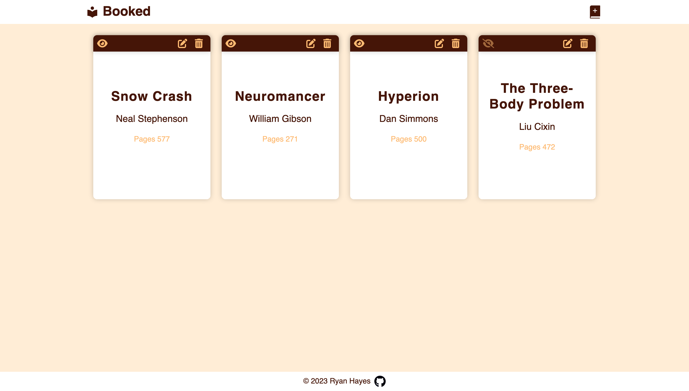

# Book Library App

<p align="center">
  <a href="#overview">Overview</a> •
  <a href="#what-i-learned">What I learned</a> •
  <a href="#useful-resources">Useful Resources</a> •
  <a href="#contact">Contact</a>
</p>

## Overview 

The purpose of this project was to create a "simple" app that would virtually store and manage your personal book library. User inputs the book's title, author, number of pages, and whether or not they have read the book.  

### Features
- Implemented **Local Storage** to store persistent book data in the library
- Used **HTML Dialog Element** to act as a modal to contain the **book input form**.
- **Toggle Read Status** by clicking on eye-icon on each book-card.
- **Delete Book** from library and local storage.

### Outcomes

- Used HTML5 **semantic elements** for better readability and structure
- Used CSS3 **grid** and **flex** to manage layout
- Used **Git** and **GitHub** for project management
- **Cross tested** on Firefox, Webkit, and  Chromium based browsers
- Responsive for both Desktop & Mobile 

### Things to Improve

- Check if book already exists in library
- Confirming delete before actually deleting a book
- Ability to edit books in library
- Pull in cover art and brief description using API
- Add a running page count of total number of pages read


### Desktop Preview



### Live Version

[Sign Up Form](https://ryanthayes.github.io/top-book-library/)

### Built With

       


## What I learned

How to **stringify and add an array** to **Local Storage**.

```JS
const addBookToStorage = () => { 
    localStorage.setItem("library", JSON.stringify(library));
};
```
How to **Prevent Default (Browser) Behavior** on **Form Submit** but add back in some default behavior like **form.reset()** and **modal.close()**.

```JS
// Event: Add book from form input
bookForm.addEventListener('submit', (e) => {
    (e).preventDefault();
    
    addBookToLibrary();
    renderBooks();
    bookForm.reset();
    bookModal.close();
});
```

How to **Create Objects** using a **Constructor or Class**.

```JS
class Book {
    constructor(title, author, pages, status) {
        this.title = title;
        this.author = author;
        this.pages = pages;
        this.status = status;
    }
}
```
## Proud Of

It took me a while to figure out how to delete a book from the array and local storage, and not just the DOM. While doing the **for loop** to loop through each book of the array to create DOM elements and render on the page, I neglected to pass through index. So, I came up with a janky way to "fake" deleting a book by using an **event.target eventListener** to select the delete button by ID and then delete it's parent element (the book card div). All this did was simply remove the item from the DOM, but upon page refresh it returned.

Once I figured out to pass in index to the "for loop", I was able to not only **properly delete a book from the array and local storage**, but also refactor and slim down the code. Instead of using a convoluted (aka janky) method to select the delete button, I simply **included the event listener** for the delete button directly into the **"for each loop".** This automagically "attached" the generated button to that specific book in the array.

```JS
const deleteBookBtn = document.createElement('button');
        deleteBookBtn.classList.add('btn-delete-book', 'fa-solid', 'fa-trash-can', 'fa-lg');
        deleteBookBtn.addEventListener('click', () => {
            deleteBook();
            addBookToStorage();
            renderBooks();
        });
```

Also, following along with that method I was able to add an **event listener** to the read/unread eye icon and toggle the read status using a *8switch statement**. I feel like this can be cleaned up even more using **=!** somehow, but for now I am happy with the results.

```JS
const bookStatus = document.createElement('p');
        switch (library.status) {
            case "Read":
                bookStatus.classList.add('book-status', 'fa', 'fa-eye', 'fa-lg');
                break;
            case "Not Read": 
                bookStatus.classList.add('book-status', 'book-status__x', 'fa', 'fa-eye-slash', 'fa-lg');
                break;
        };
        bookStatus.addEventListener('click', () => {         
            switch (library.status) {
                case "Read":
                    library.status = "Not Read";
                    break;
                case "Not Read":
                    library.status = "Read";
                    break;
            }
            renderBooks();
        });
```

## Useful resources

[The New dialog HTML Element Changes Modals Forever](https://www.youtube.com/watch?v=ywtkJkxJsdg)

## Contact

[](https://www.linkedin.com/in/ryan-t-hayes/)
